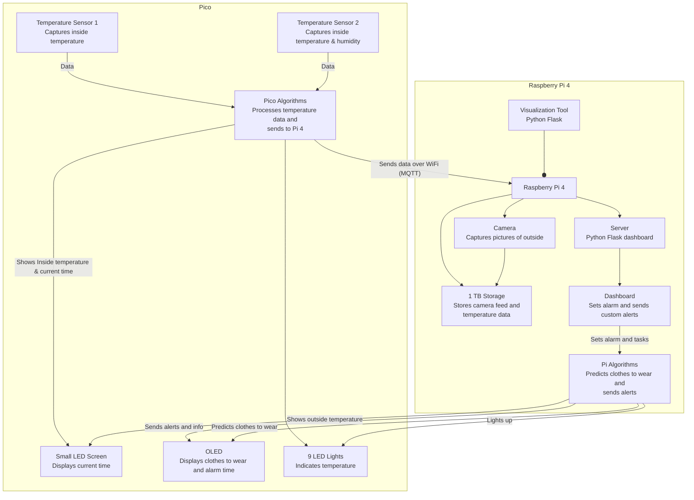
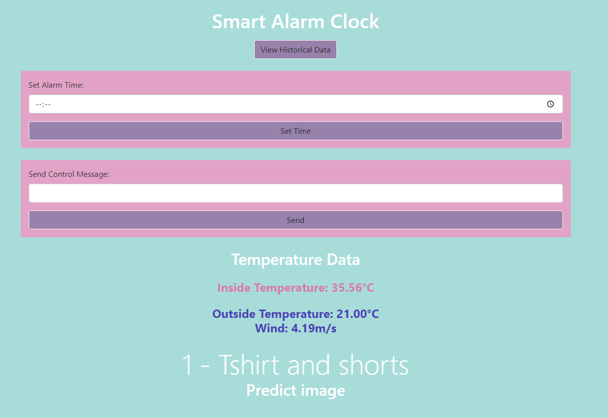
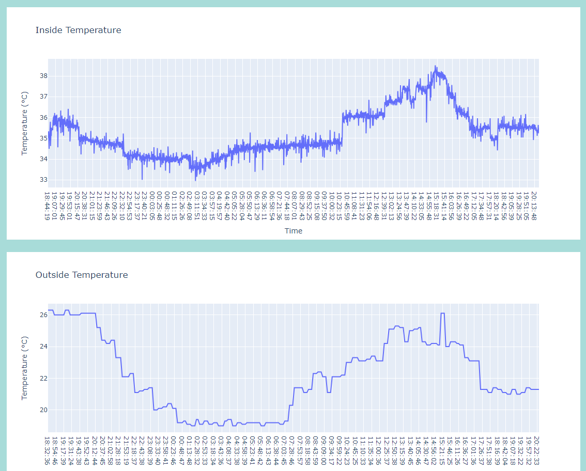
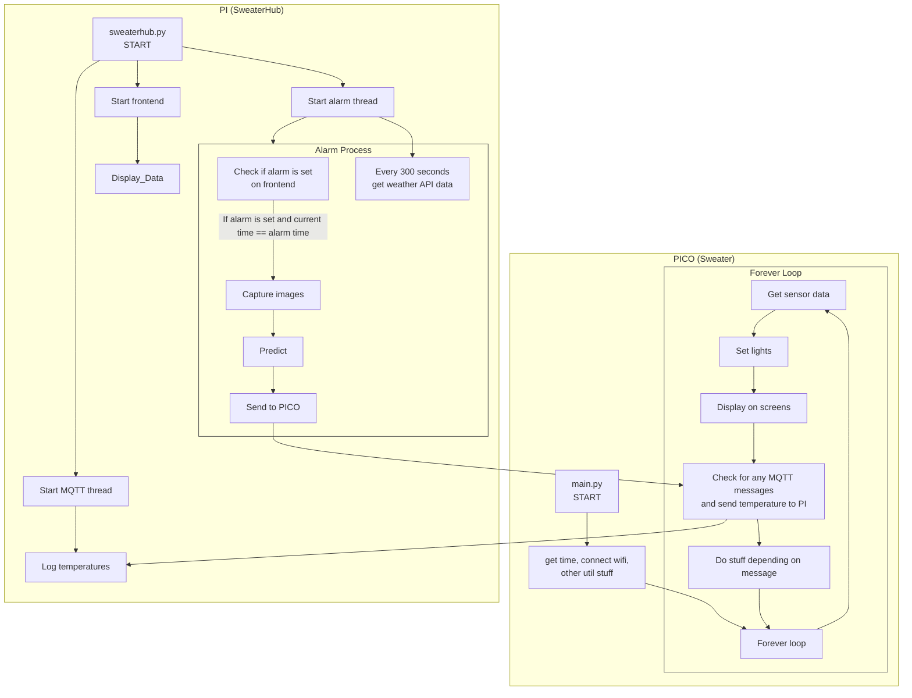
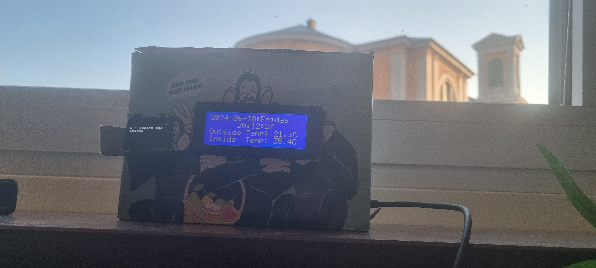

# SWEATER-IoT
**Smart Weather and Environmental Alarm for Temperature and Outfit Recommendations (SWEATER)**
### 
## Author
**Name:** Oliver Bölin

**Credentials:** ob222qw

## Project Overview
SWEATER-IoT is designed to provide smart recommendations for daily outfits based on current weather conditions and indoor temperatures. The system also functions as an alarm clock, displaying the current time, temperatures, and outfit suggestions, and allows users to set alarms and tasks via a Python Flask dashboard.
SWEATER uses two different APIs to predict the cloths to be worn. 

## Features
1. **Display**
   - Show time, weather data and alarm time.
2. **Sensors**
   - Captures inside temperatures.
4. **openAI api**
   - Used for predicting what clothes to wear based on picture taken, weather data and inside temperature.
   - You need an openAI API account and fund it. Every prediction costs 0.01$. Small sums such as 5$ will therefore last you 500 days if one prediction is made every morning.
   - Signup here [OpenAI Signup](https://platform.openai.com/signup)
5. **weatherapi**
   - Gets the outside weather data.
   - You need an weatherapi account. This is free for 1 million calls per month. Sweater makes around 8000 per month.
   - Signup here [weatherAPI Signup](https://www.weatherapi.com/)
6. **Hub**
   - Uses threading to control the MQTT communication, the flask server and the api calls.
   - Send custom commands.
   - Uses **Bootstrap** and **Plotly** to display nice GUI and Graphs.
   - Set alarm remotely.
     
**Estimated Time to Complete Setup:** Approximately 4 hours

## System Architecture




## Objective
I choose to do something unique, which has not yet been done (from what I know). With a Raspberry Pi and a USB camera, I decided to do a smart alarm clock. called Sweater. The problem for many people is either overdressing or underdressing for the weather. Just checking the temperature on the phone is not always enough, and when checking outside the window you dont know what the weather actually is. The solution of Sweater is setting an alarm for the next day, then when waking up being greeted by the temperature inside, and outside, and what clothes to wear for that day. 

## Materials

### Pico Materials and Description

| Item                                    | Picture                                                                 | Price & Link                                                                                                               | Specifications                                                                                 |
|-----------------------------------------|-------------------------------------------------------------------------|----------------------------------------------------------------------------------------------------------------------------|-----------------------------------------------------------------------------------------------|
| Raspberry Pi Pico W                     |                           | 71.2 SEK - [Electrokit](https://www.electrokit.com/raspberry-pi-pico-w)                                                    | Collects temperature and humidity data and displays information on the screens.               |
| DHT11 Temperature and Humidity Sensor   |                     | 39.2 SEK - [Electrokit](https://www.electrokit.com/digital-temperatur-och-fuktsensor-dht11)                                | Measures temperature and humidity.                                                            |
| MCP9700-E/TO TO-92 Temperature Sensor   |                       | 9.6 SEK - [Electrokit](https://www.electrokit.com/en/mcp9700-to-92-temperaturgivare)                                       | Measures temperature.                                                                         |
| Green, Red, and Yellow LEDs (3 each)    |                                                    | 74 SEK - [Amazon](https://www.amazon.se/-/en/DollaTek-200pcs-Candle-Mixed-Yellow/dp/B08FM61TB7/)                            | Lights up according to temperature.                                                           |
| I2C LCD 2004 Module 20x4 Display        |                                         | 121 SEK - [Amazon](https://www.amazon.se/-/en/Youmile-Serial-Module-Backlight-Arduino/dp/B099F2KPR4/)                       | Displays inside and outside temperature, current time, date, and day.                         |
| 1.3" OLED 128 x 64 pixels I2C           |                                            | 99 SEK - [Amazon](https://www.amazon.se/AZDelivery-compatible-Arduino-Raspberry-including/dp/B078J78R45/)                   | Displays the next alarm time and what to wear when triggered.                                 |
| Jumper Wires and Breadboard             |                            | 134 SEK - [Amazon](https://www.amazon.se/-/en/AZDelivery-Breadboard-Kit-breadboard-Book/dp/B078JGQKWP/)                     | Connects components and provides a platform for building the circuit.                         |
| Micro-USB Cable                         |                                        | Purchased previously                                                                                                        | Connects the Raspberry Pi Pico to the Raspberry Pi.                                           |

### Pi Materials and Description

| Item                                    | Picture                                                                 | Price & Link                                                                                                               | Specifications                                                                                 |
|-----------------------------------------|-------------------------------------------------------------------------|----------------------------------------------------------------------------------------------------------------------------|-----------------------------------------------------------------------------------------------|
| Raspberry Pi 4 B                        |                     | 583.2 SEK - [Electrokit](https://www.electrokit.com/raspberry-pi-4-model-b/4gb)                                            | Acts as the hub by hosting the Flask web application.                                         |
| SD Card (for Raspberry Pi)              |                     | 103.2 SEK - [Electrokit](https://www.electrokit.com/minneskort-sdhc-32gb-med-raspberry-pi-os)                              | Storage for the Raspberry Pi operating system and data.                                       |
| Power Supply for Raspberry Pi           |     | 79.2 SEK - [Electrokit](https://www.electrokit.com/raspberry-pi-4-stromforsorjning-5v-3a-usb-c-svart)                      | Powers the Raspberry Pi.                                                                      |
| USB Web Camera (Aukey PC-LM1E)          |                                            | Price varies                                                                                                                | Used for capturing images for predictions (if applicable).                                    |
| 1 TB External HDD                       |                                              | Not needed                                                                                                                  | Optional storage for additional data.                                                         |


# Setup
Follow these step-by-step instructions to successfully set up a SWEATER.

## Computer Setup

### Chosen IDE
- **IDE:** VS Code

### Basic Setup
1. **Install VS Code:**
   - Download and install VS Code from the official website.

2. **Install Python >= 3.11:**
   - Ensure Python is installed on your system. Install it from the official website if necessary.

3. **Flashing Firmware:**
   - Flash the MicroPython firmware onto the Raspberry Pi Pico by downloading the [firmware](https://micropython.org/download/RPI_PICO_W/) and dragging it into the Pico when plugged in via USB.

4. **Start Pi:**
   - Start the Pi and follow the initial setup. If you don't have a preinstalled SD card with an OS on it, you can download Raspberry Pi Imager.

## Pi Software Setup

### 1. Update Package List
First, update your package list to ensure you get the latest version available:

```sh
sudo apt update
```

## Mosquitto (MQTT Broker) Setup
To install and set up the Mosquitto MQTT broker on the **Raspberry Pi 4 B**, follow these steps:

### 1. Install Mosquitto
Install the Mosquitto broker and the Mosquitto clients:

```sh
sudo apt install mosquitto mosquitto-clients
```

### 2. Follow guide to setup mosquito
Ensure to setup the mosquitto listener on port 1883

[Mosquitto guide](https://medium.com/gravio-edge-iot-platform/how-to-set-up-a-mosquitto-mqtt-broker-securely-using-client-certificates-82b2aaaef9c8)
## Starting the HUB

### 1. Download the Hub to the Pi

```sh
sudo git clone https://github.com/frankuman/SWEATER-IoT/hub
```

### 2. Creating a virtual environment
Since the openAI python module is not working as easily as intended, we have to setup a virtual environment. But don't worry, it is easier than expected.

**1.** Install virtualenv
```sh
sudo pip install virtualenv
```
**2.** go into the downloaded directory
```sh
cd hub
```
**3.** create the environment
```sh
python3 -m venv myenv
```
**4.** activate the environment
```sh
source myenv/bin/activate
```
### 3. Install the Required Packages

```sh
pip install -r requirements.txt
```
or
```sh
pip3 install -r requirements.txt
```

### 4. Change the config.ini File

```ini
[MQTT]
broker = localhost
topic_pub = home/control
topic_sub = home/temperature
topic_time_req = home/time/request
topic_time_resp = home/time/response

[Paths]
temperature_data_file = Change to desired location
current_temperature_data = Change to desired location
image_directory = static/images

[API]
weather_url = http://api.weatherapi.com/v1/forecast.json
weather_key = Change to your API key (https://weatherapi.com)
location = Karlskrona (Change to your location)

[OpenAI]
api_key = Change to your openai API key (https://openai.com/api/)
```

### 5. Starting the hub
While the hub might not communicate at the moment, it can be started with the following command
```sh
python sweaterhub.py
```
### Access right problems
If the hub has access rights problems, you might need to give it access rights
```sh
sudo chmod -r 777 hub
```
```sh
sudo chmod -r 777 hub/static
```
```sh
sudo chmod -r 777 hub/static/images
```
```sh
sudo chmod -r 777 path/to/json_storage
```
## Pico Software

### 1. Download the sweater Pico software
```sh
git clone https://github.com/frankuman/SWEATER-IoT/sweater
```
### 2. Change the config.py file
```python
import ubinascii
import machine

SSID = 'ssid'          #change this
PASSWORD = 'password'  #change this

MQTT_BROKER = '192.168.0.101' #change this
MQTT_CLIENT_ID = ubinascii.hexlify(machine.unique_id())
MQTT_TOPIC = 'home/temperature'
MQTT_TOPIC_SUB = 'home/control'
MQTT_TOPIC_TIME_REQ = 'home/time/request'
MQTT_TOPIC_TIME_RESP = 'home/time/response'
```
## Pi Hardware
### 1. Plug the USB camera into the Pi

## Pico Hardware
### 1. Plug everything in accordingly to the Circuit Diagram
#### Circuit Diagram


### Electrical Calculations
**Power = Voltage x Current**

- OLED: 3.3V x 40mA = 132mW 
- LCD: 5V x 120mA = 600mW
- LEDs: 3V, 20mA each for 9 LEDs, total = 180mA x 3v = 540mW
- DHT11: 3V x 0.5mA = 1.5mW 
- MCP9700A: 3V x 6µA = 0.018mW
- Pico: 3.3V x 45mA = 148.5mW
- Total power consumption = 1422mW = 1.422W

**If we use a 12V 2Ah battery, we can calculate how long it will last**

(12 * 2)/(1.422) = 16.8 hours

## Getting started
Visit the localhost of your raspberry pi when everything is running.
```sh
http://192.168.0.X:5000/
```

## Platform
For this project, SweaterHub uses python Flask frontend interface paired with Plotly and Bootstrap.
**Why?**
Bootstrap creates a nice GUI which is interactive and responsive since the GUI has to be usable for phones.
For storage two JSON files are used, this creates simplicity and ease of installation for the users. I chose to create my own platform since I already had to create an interface for the alarm. I have previous experience with
flask programming so that was the best choice. And since there was already a need for the hub integrating the graphs with the hub was easy to do.
### Dashboard
The dashboard comes with various functions as seen in the picture. Below this are two pictures, one that was used for the latest prediction, and one that was used when the page was visited for camera testing purposes.
There is a possibility to send custom commands. The following commands are

**Flash the LED lights**
```sh
flash
```
**Does the same as a alarm would have been set but instantly**
```sh
alarm
```
**Displays the text on the LCD**
```sh
text to display on LCD
```
**Displays the text after OLED: on the OLED**
```sh
OLED:text to display on OLED
```
**Shows all the different clothes that are possible for prediction**
```sh
OLED:showall
```


### History
The history site shows different graphs with all the data collected.


## Core Functions
Much of the code is very uncommented and rushed and hard coded. I don't expect it to be very readable.
If you want to understand the core functions a little code and a flowchart is presented below.

### communication.py
This function is the foundation of receiving messages. In the frontend there is the possibility to unput custom messages for testing.

```python
def control_callback(topic, msg):
    topic_str = topic.decode()
    message = msg.decode()
    print(f"Received message on {topic_str}: {message}")

    if message == 'flash':
        flash_lights(1)
        print("Received flash command!")
    elif len(message) > 1 and message[0] == "2":
        global outside_temp
        outside_temp = message[2:]
        print(outside_temp)
    elif len(message) > 3 and message[0:2] == "at":
        alarmtime = message[3:]
        print("Displaying alarm")
        alarmtime = str(alarmtime)
        display_alarm(alarmtime)
    elif len(message) > 4 and message[0:4] == "pred":
        prediction = message[5:]
        print("Displaying prediction")
        display_prediction(prediction)
    elif len(message) > 4 and message[0:4] == "OLED":
        message = message[5:]
        print("Displaying OLED")
        display_on_oled(str(message))
    else:
   ...
```
### display.py
These two function are to display the alarm time on the OLED display. By using bitmap letters we write them in 
a big and nice font instead. The other functions for displaying the prediction on the OLED splits the string into a list so that
it can be displayed on the individual rows on the OLED.
```python
def draw_large_digit(digit, x, y):
    for row_index, row in enumerate(digit):
        for col_index in range(16):
            if row & (1 << (15 - col_index)):
                display.pixel(x + col_index, y + row_index, 1)

def display_alarm(alarmtime):
    display.poweron()
    display.fill(0)
    alarmtime = str(alarmtime)
    x_offset = 16
    for char in alarmtime:
        if char.isdigit():
            draw_large_digit(digits[int(char)], x_offset, 20)
            x_offset += 20 
        elif char == ':':
            draw_large_digit(colon, x_offset, 20)
            x_offset += 20

    display.text("  Alarm Time", 0, 0)
    display.show()
```
#### main.py
This is the main.py loop. To get the time for the clock it uses NTP before entering the loop. Then every 3 seconds it displays the
wind (kph), humidity, forecast (C) and the chance of rain for the day. Every other 3 seconds it displays the
date, day of the week, inside and outside temperature. It always displays the current hour, minute and seconds.
```python
   def main_loop():
        counter = 0
        temp_str = "Temp: --.-C"
        while True:
            
            current_time = adjusted_time()
            date_str = format_date(current_time)
            day_str = format_day_of_week(current_time)
            time_str = format_time(current_time)
            
            if counter % 30 == 0:
                tmpsensor1 = temp()
                outside_temp_str = get_outside_temp()
                outside_temp_str = f"Outside Temp: {outside_temp_str}C"
                print("Sensor 1: ", tmpsensor1)
                try:
                    temperature, humidity = measure_temp_humidity()
                    
                    print("Sensor 2: tmp ", temperature, " humidity: ", humidity)
                    set_lights((tmpsensor1 + temperature) / 2)
                    message = f"{(tmpsensor1 + temperature) / 2}"
                    temp_str = "Inside  Temp: {:.1f}C".format((tmpsensor1 + temperature) / 2)
                except Exception as error:
                    print("Sensor 2: Exception occurred", error)
                    set_lights(tmpsensor1)
                    message = f"{tmpsensor1}"
                    temp_str = "Inside  Temp: {:.1f}C".format(tmpsensor1)

                try:
                    mqtt_publish(client, MQTT_TOPIC, message)
                except Exception as error:
                    print("/--/ Could not send via MQTT")
            
            set_lights((tmpsensor1 + temperature) / 2)
            print(date_str, day_str, time_str, temp_str)
            date_str = f"{date_str}:{day_str}"
            if counter % 6 == 0 or counter % 6 == 1 or counter % 6 == 2:
                wind_speed, outside_humidity, forecast_avg_temp, chance_of_rain = get_weather_data()
                toptext = f"     w:{wind_speed} h:{outside_humidity}"
                bottomtext = f"fcast:{forecast_avg_temp} rain%:{chance_of_rain}"
                display_message(toptext, outside_temp_str, time_str, bottomtext)
            else:
                display_message(date_str, outside_temp_str, time_str, temp_str)
            
            try:
                client.check_msg()
            except Exception as error:
                print(error)
                print("/--/ Could not check the messages via MQTT")

            counter += 1
            time.sleep(1)

    time.sleep(1)
    main_loop()

```
#### sweaterhub.py
This threaded function checks the global variable alarm_time. If its set via the flask interface and then triggered it will get the weather data and then 
call on the trigger function. The trigger function then takes 5 photos to get the camera used to the lighting, and then send all the data to the
gpt-4o API.

```python
def check_alarm_time():
    global alarm_time
    global last_prediction_time
    counter = 0
    print("Starting check_alarm_time thread")
    while True:
        current_time = datetime.now()

        if alarm_time:
            if current_time.strftime("%H:%M") == alarm_time:
                weather_data = store_api_temp()
                try:
                    alarm_trigger(weather_data)
                except Exception as e: #use latest data if api call didnt work
                    with open(temperature_data_file, 'r') as file:
                        lines = file.readlines()
                    if lines:
                        weather_data = json.loads(lines[-1])
                    alarm_trigger(weather_data)
                alarm_time = None

        if counter % 300 == 0:  # every 5 minutes right now, can be updates
            weather_data = store_api_temp()
            if weather_data:
                current_temp = weather_data['current_temp']
                send_api_temp(f"2:{current_temp}")
                if alarm_time == None:
                    wind_speed = weather_data['wind_speed']
                    humidity = weather_data['humidity']
                    forecast_avg_temp = weather_data['forecast_avg_temp']
                    chance_of_rain = weather_data['chance_of_rain']
                    LCD_TEXT = f"wd:Wind:{wind_speed}|Humidity:{humidity}|forecast:{forecast_avg_temp}|rain%:{chance_of_rain}"
                    client.publish(MQTT_TOPIC_PUB, LCD_TEXT)

            else: #if api call failed send latest temp with X indicating error
                with open(temperature_data_file, 'r') as file:
                    lines = file.readlines()
                if lines:
                    weather_data = json.loads(lines[-1])
                    current_temp = weather_data['current_temp']
                    send_api_temp(f"2:{current_temp}X")

        counter += 1
        time.sleep(1)

alarm_thread = threading.Thread(target=check_alarm_time)
alarm_thread.start()
app.alarm_thread_started = True
```

### Data Transmission
To send data from the hub to the pico and from the pico to the hub the MQTT protocol is used. This protocol is lightweight and easy to implement.
No particular security functions have been introduced in this version, but I can guess that SSL can be easily implemented in the future.
- **Pico to PI** The pico sends data to the pico every 30 seconds
- **Pi to Pico** The pico sends data to the pico every 300 seconds or when an alarm is triggered
**Why?**
This was the best option since the PI already uses wifi. There is no need to have long range connectivity (such as LoRa) since everything should be close anyways.
The flask server is only accessible on the local network, and the pi has the capability to be a mqtt broker. It's perfect! :)

### Data Storage
Since memory might be an issue for future users (32 GB can be the cap for many users), only two pictures are saved at the same time. When a new is taken it is overwritten.
For storing data, only two (2!) JSON files are used. JSON is easy to create, lightweight, and doesn't take up a lot of storage. The user can also easily remove them if they want to clear them
and the software will create new empty ones. The data is stored forever. But the graphs only display 24H of data. There is no automation or trigger depending on the data in Sweater.

### Other issues
#### Sweater is not receiving data from SweaterHUB.
If the sweater is not receiving any data from the hub, keep the hub running and unplug the sweater and plug it back it. It should receive data again.

## Finalizing the Design
### 3D printable case
There is a 3D printable case if any users would attempt to print one. It features holes for the screens and a hole for the LED lamps. The hole for the LED lamps also has a 
inserter for a frosted diffuser acrylic sheet. This case does need some work tho.
It has 3 holes on the side, incase anyone attempts to implement buttons
It needs something to hold the displays.

### Final Thoughts
This project was really fun to learn IoT programming, MQTT messaging, and programming for screens. I believe Sweater is a bit unique and a cool concept.
#### Future work
For future work, there is some work which would be interesting to see.
1. Implement the camera on the pico instead
2. Fix the 3D printable case
3. Use the OLED more, since it doesn't show any interactive stuff at the moment.

### Pictures



### Video Presentation

## License

This project is licensed under the MIT License. See the [LICENSE](LICENSE) file for details.


