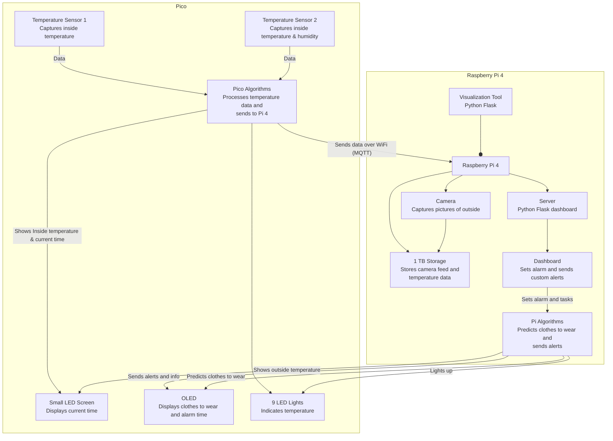

# SWEATER-IoT
**Smart Weather and Environmental Alarm for Temperature and Outfit Recommendations (SWEATER)**
### 
## Author
**Name:** Oliver Bölin

**Credentials:** ob222qw

## Project Overview
SWEATER-IoT is designed to provide smart recommendations for daily outfits based on current weather conditions and indoor temperatures. The system also functions as an alarm clock, displaying the current time, temperatures, and outfit suggestions, and allows users to set alarms and tasks via a Python Flask dashboard. The prediction is done by the **OpenAI** GPT4o API and the outside temperatures is fetched via the **weatherapi** api.

## System Architecture



**Estimated Time to Complete:** Approximately 15 hours

## Objective
I choose to do something unique, which has not yet been done (from what I know). With a Raspberry Pi and a USB camera, I decided to do a smart alarm clock. called Sweater. The problem for many people is either overdressing or underdressing for the weather. Just checking the temperature on the phone is not always enough, and when checking outside the window you dont know what the weather actually is. The solution of Sweater is setting an alarm for the next day, then when waking up being greeted by the temperature inside, and outside, and what clothes to wear for that day. 

## Materials
### List of Materials for Pico
1. Raspberry Pi Pico W
2. DHT11 Temperature and Humidity Sensor
3. MCP9700-E/TO TO-92 temperature sensor
4. 3 Green LEDs, 3 Red LEDs, 3 Yellow LEDs
5. I2C LCD 2004 Module 20x4 Display
6. 1.3" OLED 128 x 64 pixels I2C
7. Jumper Wires
8. Breadboard
9. Micro-USB Cable
### List of Materials for Pi
10. SD Card (for Raspberry Pi)
11. Power Supply for Raspberry Pi
12. USB Web camera (Aukey PC-LM1E Full HD)
13. 1 TB external HDD (not necessarily needed)

### Material Specifications
- **Raspberry Pi:** Acts as the hub by hosting the Flask web application, which is where the user can set the alarm and also see data.
- **Raspberry Pi Pico:** Collects temperature and humidity data and displays information on the screens.
- **DHT22 Sensor:** Measures temperature and humidity.
-  **MCP9700-E/TO TO-92 temperature sensor:** Measures temperature.
- **Jumper Wires:** Connect components.
- **Breadboard:** Provides a platform for building the circuit.
- **3 Green LEDs, 3 Red LEDs, 3 Yellow LEDs:** Lights up accordingly to temperature.
- **I2C LCD 2004 Module 20x4 Display:** Displays inside, outside temperature, current time, date, and day.
- **1.3" OLED 128 x 64 pixels I2C:** Displays what time the next alarm is set and when triggered what to wear.

### Cost and Purchase Locations

#### List of Materials for Pico

| Item                                    | Picture                                                                 | Price & Link                                                                                                               |
|-----------------------------------------|-------------------------------------------------------------------------|----------------------------------------------------------------------------------------------------------------------------|
| Raspberry Pi Pico W                     |                           | 71.2 SEK - [Electrokit](https://www.electrokit.com/raspberry-pi-pico-w)                                                    |
| DHT11 Temperature and Humidity Sensor   |                     | 39.2 SEK - [Electrokit](https://www.electrokit.com/digital-temperatur-och-fuktsensor-dht11)                                |
| MCP9700-E/TO TO-92 Temperature Sensor   |                       | 9.6 SEK - [Electrokit](https://www.electrokit.com/en/mcp9700-to-92-temperaturgivare)                                       |
| Green, Red, and Yellow LEDs (3 each)    |                                                    | 74 SEK - [Amazon](https://www.amazon.se/-/en/DollaTek-200pcs-Candle-Mixed-Yellow/dp/B08FM61TB7/)                            |
| I2C LCD 2004 Module 20x4 Display        |                                         | 121 SEK - [Amazon](https://www.amazon.se/-/en/Youmile-Serial-Module-Backlight-Arduino/dp/B099F2KPR4/)                       |
| 1.3" OLED 128 x 64 pixels I2C           |                                            | 99 SEK - [Amazon](https://www.amazon.se/AZDelivery-compatible-Arduino-Raspberry-including/dp/B078J78R45/)                   |
| Jumper Wires and Breadboard             |                            | 134 SEK - [Amazon](https://www.amazon.se/-/en/AZDelivery-Breadboard-Kit-breadboard-Book/dp/B078JGQKWP/)                     |
| Micro-USB Cable                         |                                        | Purchased previously                                                                                                        |

#### List of Materials for Pi

| Item                             | Picture                                                                 | Price & Link                                                                                                               |
|----------------------------------|-------------------------------------------------------------------------|----------------------------------------------------------------------------------------------------------------------------|
| Raspberry Pi 4 B       |                     | 583.2 SEK - [https://www.electrokit.com/minneskort-sdhc-32gb-med-raspberry-pi-os](https://www.electrokit.com/raspberry-pi-4-model-b/4gb))        
| SD Card (for Raspberry Pi)       |                     | 103.2 SEK - [Electrokit](https://www.electrokit.com/minneskort-sdhc-32gb-med-raspberry-pi-os)                              |
| Power Supply for Raspberry Pi    |     | 79.2 SEK - [Electrokit](https://www.electrokit.com/raspberry-pi-4-stromforsorjning-5v-3a-usb-c-svart)                      |
| USB Web Camera (Aukey PC-LM1E)   |                                            | Price varies                                                                                                        |
| 1 TB External HDD                |                                              | Not needed                                                                                                        |


## Computer Setup
### Chosen IDE
- **IDE:** VS Code

### Basic setup
1. **Install VS Code:**
   Download and install VS Code from the official website.
2. **Install Python >= 3.11:**
   Ensure Python is installed on your system. Install it from the official website if necessary.
3. **Flashing Firmware:**
   Flash the MicroPython firmware onto the Raspberry Pi Pico i.e. download the [firmware](https://micropython.org/download/RPI_PICO_W/) and drag it into the pico when plugged in via USB.

### Software Setup

## Hardware Setup
### Putting Everything Together
### Circuit Diagram


### Electrical Calculations


### Assembly Instructions


## Platform
### Chosen Platform


### Platform Functionality


### Reasons for Choosing This Platform


## The Code
### Core Functions
#### Flask Server (collector.py)
```python
def code_is_not_here_yet():
    pass

```


### Data Transmission

### Design Choices


## Presenting the Data
### Dashboard


### Data Storage


### Automation


## Finalizing the Design
### Final Results


### Final Thoughts

### Pictures

### Video Presentation

## License

This project is licensed under the MIT License. See the [LICENSE](LICENSE) file for details.


