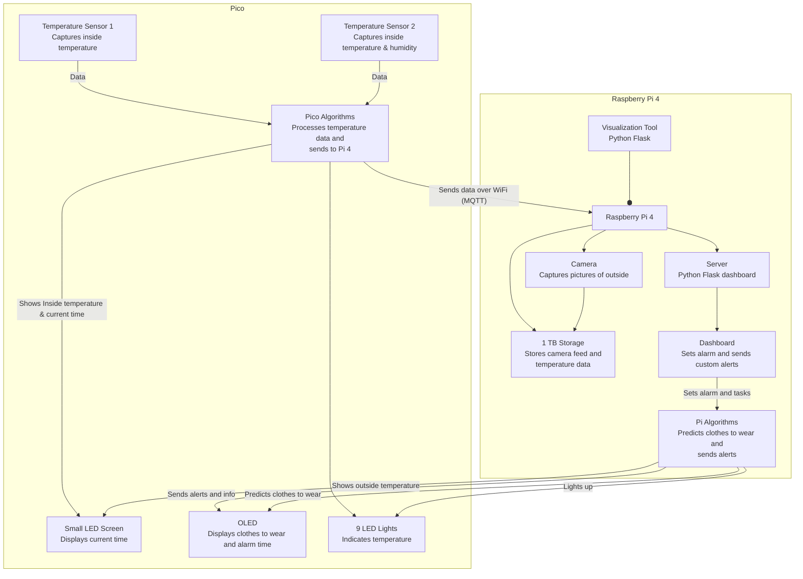
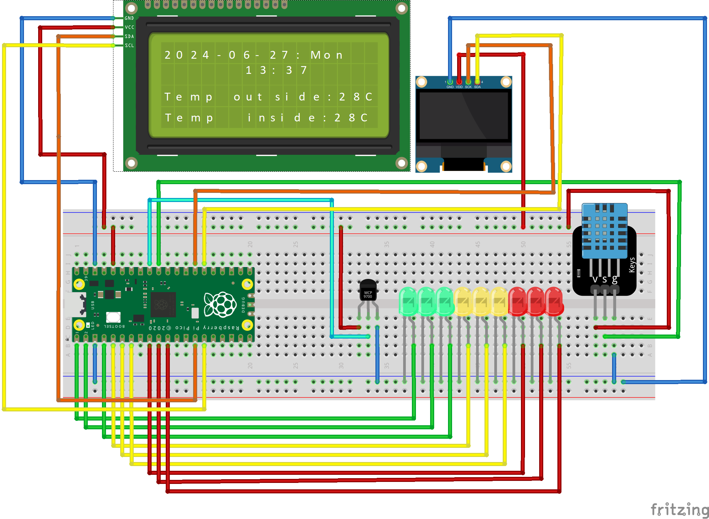

# SWEATER-IoT
**Smart Weather and Environmental Alarm for Temperature and Outfit Recommendations (SWEATER)**
### 
## Author
**Name:** Oliver Bölin

**Credentials:** ob222qw

## Project Overview
SWEATER-IoT is designed to provide smart recommendations for daily outfits based on current weather conditions and indoor temperatures. The system also functions as an alarm clock, displaying the current time, temperatures, and outfit suggestions, and allows users to set alarms and tasks via a Python Flask dashboard.
SWEATER uses two different APIs to predict the cloths to be worn. 
1. **openAI api**
   - You need an openAI API account and fund it. Every prediction costs 0.01$. Small sums such as 5$ will therefore last you 500 days if one prediction is made every morning.
   - Signup here [OpenAI Signup](https://platform.openai.com/signup)
3. **weatherapi**
   - You need an weatherapi account. This is free for 1 million calls per month. Sweater makes around 8000 per month.
   - Signup here [weatherAPI Signup](https://www.weatherapi.com/)


**Estimated Time to Complete Setup:** Approximately 4 hours

## System Architecture




## Objective
I choose to do something unique, which has not yet been done (from what I know). With a Raspberry Pi and a USB camera, I decided to do a smart alarm clock. called Sweater. The problem for many people is either overdressing or underdressing for the weather. Just checking the temperature on the phone is not always enough, and when checking outside the window you dont know what the weather actually is. The solution of Sweater is setting an alarm for the next day, then when waking up being greeted by the temperature inside, and outside, and what clothes to wear for that day. 

## Materials

### Pico Materials and Description

| Item                                    | Picture                                                                 | Price & Link                                                                                                               | Specifications                                                                                 |
|-----------------------------------------|-------------------------------------------------------------------------|----------------------------------------------------------------------------------------------------------------------------|-----------------------------------------------------------------------------------------------|
| Raspberry Pi Pico W                     |                           | 71.2 SEK - [Electrokit](https://www.electrokit.com/raspberry-pi-pico-w)                                                    | Collects temperature and humidity data and displays information on the screens.               |
| DHT11 Temperature and Humidity Sensor   |                     | 39.2 SEK - [Electrokit](https://www.electrokit.com/digital-temperatur-och-fuktsensor-dht11)                                | Measures temperature and humidity.                                                            |
| MCP9700-E/TO TO-92 Temperature Sensor   |                       | 9.6 SEK - [Electrokit](https://www.electrokit.com/en/mcp9700-to-92-temperaturgivare)                                       | Measures temperature.                                                                         |
| Green, Red, and Yellow LEDs (3 each)    |                                                    | 74 SEK - [Amazon](https://www.amazon.se/-/en/DollaTek-200pcs-Candle-Mixed-Yellow/dp/B08FM61TB7/)                            | Lights up according to temperature.                                                           |
| I2C LCD 2004 Module 20x4 Display        |                                         | 121 SEK - [Amazon](https://www.amazon.se/-/en/Youmile-Serial-Module-Backlight-Arduino/dp/B099F2KPR4/)                       | Displays inside and outside temperature, current time, date, and day.                         |
| 1.3" OLED 128 x 64 pixels I2C           |                                            | 99 SEK - [Amazon](https://www.amazon.se/AZDelivery-compatible-Arduino-Raspberry-including/dp/B078J78R45/)                   | Displays the next alarm time and what to wear when triggered.                                 |
| Jumper Wires and Breadboard             |                            | 134 SEK - [Amazon](https://www.amazon.se/-/en/AZDelivery-Breadboard-Kit-breadboard-Book/dp/B078JGQKWP/)                     | Connects components and provides a platform for building the circuit.                         |
| Micro-USB Cable                         |                                        | Purchased previously                                                                                                        | Connects the Raspberry Pi Pico to the Raspberry Pi.                                           |

### Pi Materials and Description

| Item                                    | Picture                                                                 | Price & Link                                                                                                               | Specifications                                                                                 |
|-----------------------------------------|-------------------------------------------------------------------------|----------------------------------------------------------------------------------------------------------------------------|-----------------------------------------------------------------------------------------------|
| Raspberry Pi 4 B                        |                     | 583.2 SEK - [Electrokit](https://www.electrokit.com/raspberry-pi-4-model-b/4gb)                                            | Acts as the hub by hosting the Flask web application.                                         |
| SD Card (for Raspberry Pi)              |                     | 103.2 SEK - [Electrokit](https://www.electrokit.com/minneskort-sdhc-32gb-med-raspberry-pi-os)                              | Storage for the Raspberry Pi operating system and data.                                       |
| Power Supply for Raspberry Pi           |     | 79.2 SEK - [Electrokit](https://www.electrokit.com/raspberry-pi-4-stromforsorjning-5v-3a-usb-c-svart)                      | Powers the Raspberry Pi.                                                                      |
| USB Web Camera (Aukey PC-LM1E)          |                                            | Price varies                                                                                                                | Used for capturing images for predictions (if applicable).                                    |
| 1 TB External HDD                       |                                              | Not needed                                                                                                                  | Optional storage for additional data.                                                         |


# Setup
Follow these step-by-step instructions to successfully set up a SWEATER.

## Computer Setup

### Chosen IDE
- **IDE:** VS Code

### Basic Setup
1. **Install VS Code:**
   - Download and install VS Code from the official website.

2. **Install Python >= 3.11:**
   - Ensure Python is installed on your system. Install it from the official website if necessary.

3. **Flashing Firmware:**
   - Flash the MicroPython firmware onto the Raspberry Pi Pico by downloading the [firmware](https://micropython.org/download/RPI_PICO_W/) and dragging it into the Pico when plugged in via USB.

4. **Start Pi:**
   - Start the Pi and follow the initial setup. If you don't have a preinstalled SD card with an OS on it, you can download Raspberry Pi Imager.

## Pi Software Setup

### 1. Update Package List
First, update your package list to ensure you get the latest version available:

```sh
sudo apt update
```

## Mosquitto (MQTT Broker) Setup
To install and set up the Mosquitto MQTT broker on the **Raspberry Pi 4 B**, follow these steps:

### 1. Install Mosquitto
Install the Mosquitto broker and the Mosquitto clients:

```sh
sudo apt install mosquitto mosquitto-clients
```

### 2. Follow guide to setup mosquito
Ensure to setup the mosquitto listener on port 1883

[Mosquitto guide](https://medium.com/gravio-edge-iot-platform/how-to-set-up-a-mosquitto-mqtt-broker-securely-using-client-certificates-82b2aaaef9c8)
## Starting the HUB

### 1. Download the Hub to the Pi

```sh
sudo git clone https://github.com/frankuman/SWEATER-IoT/hub
```

### 2. Creating a virtual environment
Since the openAI python module is not working as easily as intended, we have to setup a virtual environment. But don't worry, it is easier than expected.

**1.** Install virtualenv
```sh
sudo pip install virtualenv
```
**2.** go into the downloaded directory
```sh
cd hub
```
**3.** create the environment
```sh
python3 -m venv myenv
```
**4.** activate the environment
```sh
source myenv/bin/activate
```
### 3. Install the Required Packages

```sh
pip install -r requirements.txt
```
or
```sh
pip3 install -r requirements.txt
```

### 3. Change the config.ini File

```ini
[MQTT]
broker = localhost
topic_pub = home/control
topic_sub = home/temperature
topic_time_req = home/time/request
topic_time_resp = home/time/response

[Paths]
temperature_data_file = Change to desired location
current_temperature_data = Change to desired location
image_directory = static/images

[API]
weather_url = http://api.weatherapi.com/v1/forecast.json
weather_key = Change to your API key (https://weatherapi.com)
location = Karlskrona (Change to your location)

[OpenAI]
api_key = Change to your openai API key (https://openai.com/api/)
```

### 4. Starting the hub
While the hub might not communicate at the moment, it can be started with the following command
```sh
python sweaterhub.py
```
### Access right problems
If the hub has access rights problems, you might need to give it access rights
```sh
sudo chmod -r 777 hub
```
```sh
sudo chmod -r 777 hub/static
```
```sh
sudo chmod -r 777 hub/static/images
```
```sh
sudo chmod -r 777 path/to/json_storage
```
## Pico Software

### 1. Download the sweater Pico software
```sh
git clone https://github.com/frankuman/SWEATER-IoT/sweater
```


## Pi Hardware
### 1. Plug the USB camera into the Pi

## Pico Hardware
### 1. Plug everything in accordingly to the Circuit Diagram
#### Circuit Diagram


### Electrical Calculations


### Assembly Instructions

#### Putting Everything Together

## Platform
### Chosen Platform


### Platform Functionality


### Reasons for Choosing This Platform


## The Code
### Core Functions
#### Flask Server (collector.py)
```python
def code_is_not_here_yet():
    pass

```


### Data Transmission

### Design Choices


## Presenting the Data
### Dashboard


### Data Storage


### Automation

### Other issues
#### Sweater is not receiving data from SweaterHUB.
If the sweater is not receiving any data from the hub, keep the hub running and unplug the sweater and plug it back it. It should receive data again.

## Finalizing the Design
### Final Results


### Final Thoughts

### Pictures

### Video Presentation

## License

This project is licensed under the MIT License. See the [LICENSE](LICENSE) file for details.


