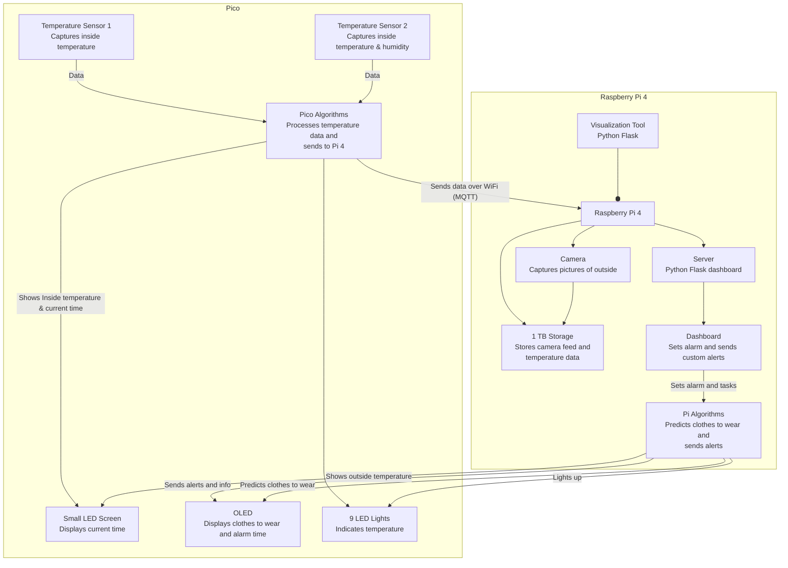
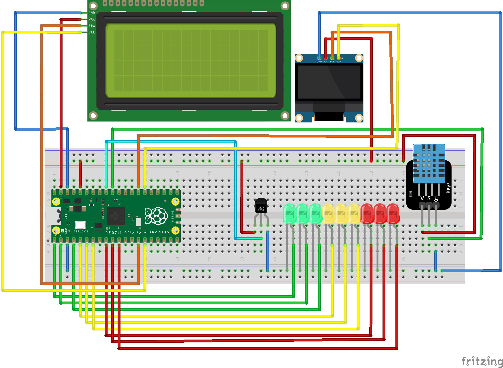
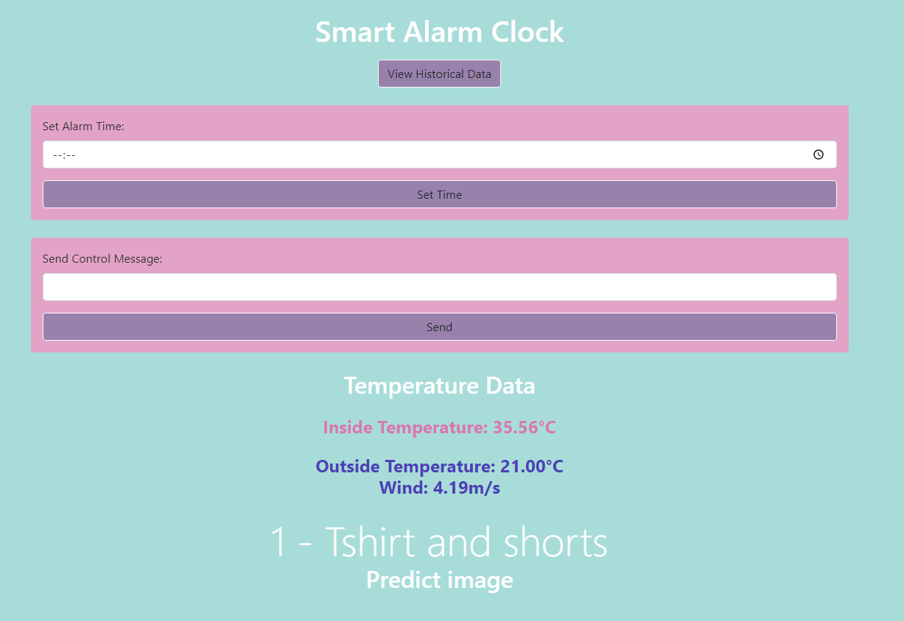
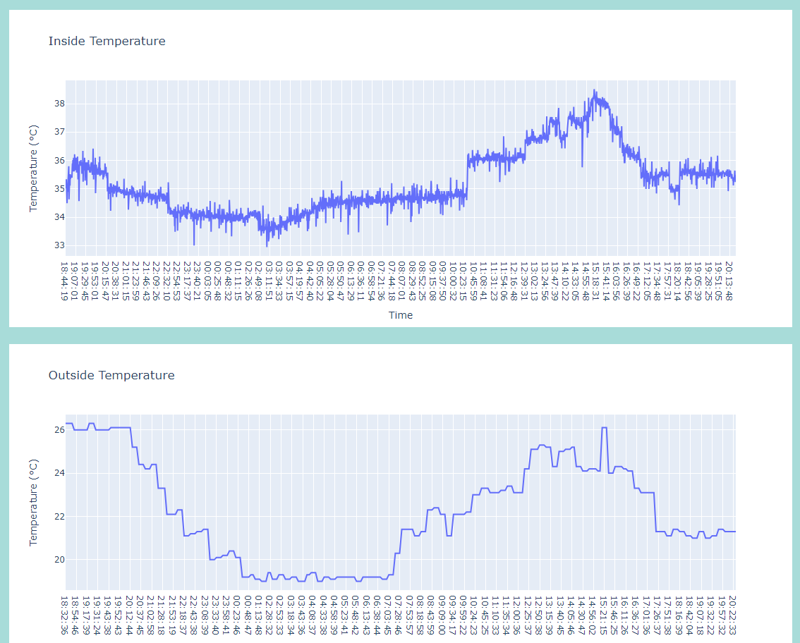
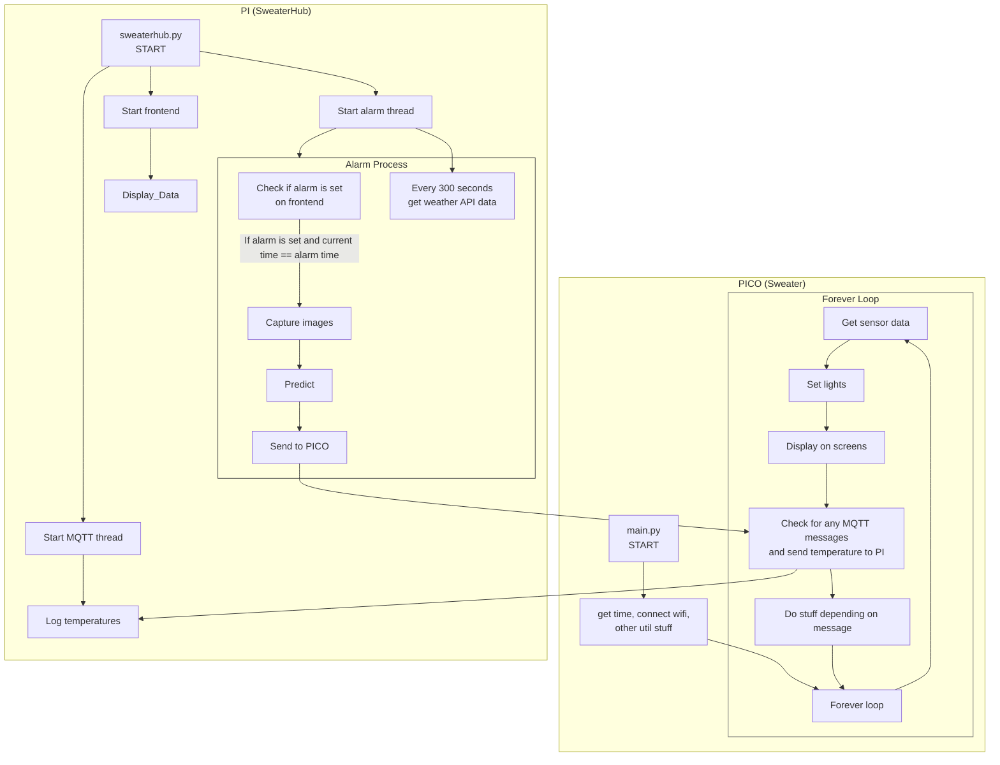
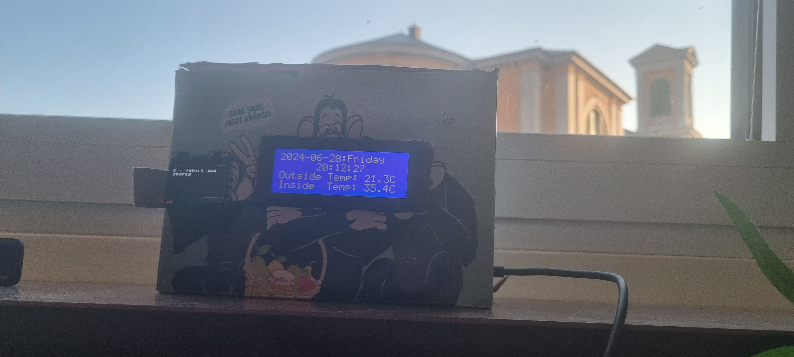

# SWEATER-IoT
**Smart Weather and Environmental Alarm for Temperature and Outfit Recommendations (SWEATER)**

## Table of Contents
- [Author](#author)
- [Project Overview](#project-overview)
- [Features](#features)
- [System Architecture](#system-architecture)
- [Objective](#objective)
- [Materials](#materials)
  - [Pico Materials and Description](#pico-materials-and-description)
  - [Pi Materials and Description](#pi-materials-and-description)
- [Setup](#setup)
  - [Computer Setup](#computer-setup)
  - [Pi Software Setup](#pi-software-setup)
  - [Mosquitto (MQTT Broker) Setup](#mosquitto-mqtt-broker-setup)
  - [Starting the HUB](#starting-the-hub)
  - [Pico Software](#pico-software)
  - [Pi Hardware](#pi-hardware)
  - [Pico Hardware](#pico-hardware)
- [Getting Started](#getting-started)
- [Platform](#platform)
- [Core Functions](#core-functions)
- [Data Transmission](#data-transmission)
- [Data Storage](#data-storage)
- [Other Issues](#other-issues)
- [Finalizing the Design](#finalizing-the-design)
- [Pictures](#pictures)
- [Video Presentation](#video-presentation)
- [License](#license)

## Author
**Name:** Oliver Bölin

**Credentials:** ob222qw

## Project Overview
SWEATER-IoT is designed to provide smart recommendations for daily outfits based on current weather conditions and indoor temperatures. The system also functions as an alarm clock, displaying the current time, temperatures, and outfit suggestions, and allows users to set alarms and tasks via a Python Flask dashboard. SWEATER uses two different APIs to predict the clothes to be worn.

**Estimated Time to Complete Setup:** Approximately 4 hours

## Features
1. **Display**
   - Show time, weather data, and alarm time.
2. **Sensors**
   - Captures inside temperatures.
3. **OpenAI API**
   - Used for predicting what clothes to wear based on picture taken, weather data, and inside temperature.
   - You need an OpenAI API account and funds. Every prediction costs $0.01. Small sums such as $5 will therefore last you 500 days if one prediction is made every morning.
   - Signup here [OpenAI Signup](https://platform.openai.com/signup)
4. **WeatherAPI**
   - Gets the outside weather data.
   - You need a WeatherAPI account. This is free for 1 million calls per month. Sweater makes around 8000 per month.
   - Signup here [WeatherAPI Signup](https://www.weatherapi.com/)
5. **Hub**
   - Uses threading to control the MQTT communication, the Flask server, and the API calls.
   - Send custom commands.
   - Uses **Bootstrap** and **Plotly** to display nice GUI and graphs.
   - Set alarm remotely.

## System Architecture



## Objective
I chose to do something unique, which has not yet been done (from what I know). With a Raspberry Pi and a USB camera, I decided to do a smart alarm clock called Sweater. The problem for many people is either overdressing or underdressing for the weather. Just checking the temperature on the phone is not always enough, and when checking outside the window you don't know what the weather actually is. The solution of Sweater is setting an alarm for the next day, then when waking up being greeted by the temperature inside, and outside, and what clothes to wear for that day. 

The collected data will be used to provide accurate outfit recommendations based on historical weather patterns and user preferences. By analyzing the most recent data, the system can use it for predictions and offer more personalized advice.
The collected data is also used to display graphs in the historical section of the hub. Here five different graphs are shown.
1. Inside temperature
2. Outside temperature
3. Feels like temperature
4. Wind speed
5. Outside Humidity

## Materials

### Pico Materials and Description

| Item                                    | Picture                                                                 | Price & Link                                                                                                               | Specifications                                                                                 |
|-----------------------------------------|-------------------------------------------------------------------------|----------------------------------------------------------------------------------------------------------------------------|-----------------------------------------------------------------------------------------------|
| Raspberry Pi Pico W                     |                           | 71.2 SEK - [Electrokit](https://www.electrokit.com/raspberry-pi-pico-w)                                                    | Collects temperature and humidity data and displays information on the screens.               |
| DHT11 Temperature and Humidity Sensor   |                     | 39.2 SEK - [Electrokit](https://www.electrokit.com/digital-temperatur-och-fuktsensor-dht11)                                | Measures temperature and humidity.                                                            |
| MCP9700-E/TO TO-92 Temperature Sensor   |                       | 9.6 SEK - [Electrokit](https://www.electrokit.com/en/mcp9700-to-92-temperaturgivare)                                       | Measures temperature.                                                                         |
| Green, Red, and Yellow LEDs (3 each)    |                                                    | 74 SEK - [Amazon](https://www.amazon.se/-/en/DollaTek-200pcs-Candle-Mixed-Yellow/dp/B08FM61TB7/)                            | Lights up according to temperature.                                                           |
| I2C LCD 2004 Module 20x4 Display        |                                         | 121 SEK - [Amazon](https://www.amazon.se/-/en/Youmile-Serial-Module-Backlight-Arduino/dp/B099F2KPR4/)                       | Displays inside and outside temperature, current time, date, and day.                         |
| 1.3" OLED 128 x 64 pixels I2C           |                                            | 99 SEK - [Amazon](https://www.amazon.se/AZDelivery-compatible-Arduino-Raspberry-including/dp/B078J78R45/)                   | Displays the next alarm time and what to wear when triggered.                                 |
| Jumper Wires and Breadboard             |                            | 134 SEK - [Amazon](https://www.amazon.se/-/en/AZDelivery-Breadboard-Kit-breadboard-Book/dp/B078JGQKWP/)                     | Connects components and provides a platform for building the circuit.                         |
| Micro-USB Cable                         |                                        | Purchased previously                                                                                                        | Connects the Raspberry Pi Pico to the Raspberry Pi.                                           |

### Pi Materials and Description

| Item                                    | Picture                                                                 | Price & Link                                                                                                               | Specifications                                                                                 |
|-----------------------------------------|-------------------------------------------------------------------------|----------------------------------------------------------------------------------------------------------------------------|-----------------------------------------------------------------------------------------------|
| Raspberry Pi 4 B                        |                     | 583.2 SEK - [Electrokit](https://www.electrokit.com/raspberry-pi-4-model-b/4gb)                                            | Acts as the hub by hosting the Flask web application.                                         |
| SD Card (for Raspberry Pi)              |                     | 103.2 SEK - [Electrokit](https://www.electrokit.com/minneskort-sdhc-32gb-med-raspberry-pi-os)                              | Storage for the Raspberry Pi operating system and data.                                       |
| Power Supply for Raspberry Pi           |     | 79.2 SEK - [Electrokit](https://www.electrokit.com/raspberry-pi-4-stromforsorjning-5v-3a-usb-c-svart)                      | Powers the Raspberry Pi.                                                                      |
| USB Web Camera (Aukey PC-LM1E)          |                                            | Price varies                                                                                                                | Used for capturing images for predictions.                                    |
| 1 TB External HDD                       |                                              | Not needed                                                                                                                  | Optional storage for additional data.                                                         |

## Setup
Follow these step-by-step instructions to successfully set up SWEATER.

### Computer Setup

#### Chosen IDE
- **IDE:** [VS Code](https://code.visualstudio.com/)

#### Basic Setup
1. **Install VS Code:**
   - Download and install VS Code from the [official website](https://code.visualstudio.com/).

2. **Install Python >= 3.11:**
   - Ensure Python is installed on your system. Install it from the [official website](https://www.python.org/downloads/) if necessary.

3. **Flashing Firmware:**
   - Flash the MicroPython firmware onto the Raspberry Pi Pico by downloading the [firmware](https://micropython.org/download/RPI_PICO_W/) and dragging it into the Pico when plugged in via USB.

4. **Start Pi:**
   - Start the Pi and follow the initial setup. If you don't have a preinstalled SD card with an OS on it, you can download [Raspberry Pi Imager](https://www.raspberrypi.org/software/).
## Pi Software Setup

### 1. Update Package List
First, update your package list to ensure you get the latest version available:

```sh
sudo apt update
```

## Mosquitto (MQTT Broker) Setup
To install and set up the Mosquitto MQTT broker on the **Raspberry Pi 4 B**, follow these steps:

### 1. Install Mosquitto
Install the Mosquitto broker and the Mosquitto clients:

```sh
sudo apt install mosquitto mosquitto-clients
```

### 2. Setup Mosquitto
Ensure to set up the Mosquitto listener on port 1883. Follow the guide here for detailed instructions: [Mosquitto Guide](https://medium.com/gravio-edge-iot-platform/how-to-set-up-a-mosquitto-mqtt-broker-securely-using-client-certificates-82b2aaaef9c8)

## Starting the HUB

### 1. Download the Hub to the Pi

```sh
sudo git clone https://github.com/frankuman/SWEATER-IoT/hub
```

### 2. Creating a Virtual Environment
Since the OpenAI Python module may not work easily, we need to set up a virtual environment. Don't worry, it's easier than expected.

1. Install virtualenv
   ```sh
   sudo pip install virtualenv
   ```
2. Go into the downloaded directory
   ```sh
   cd hub
   ```
3. Create the environment
   ```sh
   python3 -m venv myenv
   ```
4. Activate the environment
   ```sh
   source myenv/bin/activate
   ```

### 3. Install the Required Packages

```sh
pip install -r requirements.txt
```

### 4. Change the config.ini File

```ini
[MQTT]
broker = localhost
topic_pub = home/control
topic_sub = home/temperature
topic_time_req = home/time/request
topic_time_resp = home/time/response

[Paths]
temperature_data_file = Change to desired location
current_temperature_data = Change to desired location
image_directory = static/images

[API]
weather_url = http://api.weatherapi.com/v1/forecast.json
weather_key = Change to your API key (https://weatherapi.com)
location = Karlskrona (Change to your location)

[OpenAI]
api_key = Change to your openai API key (https://openai.com/api/)
```

### 5. Starting the Hub
While the hub might not communicate at the moment, it can be started with the following command
```sh
python sweaterhub.py
```

### Access Rights Problems
If the hub has access rights problems, you might need to give it access rights

```sh
sudo chmod -R 777 hub
sudo chmod -R 777 hub/static
sudo chmod -R 777 hub/static/images
sudo chmod -R 777 path/to/json_storage
```

## Pico Software

### 1. Download the Sweater Pico Software

```sh
git clone https://github.com/frankuman/SWEATER-IoT/sweater
```

### 2. Change the config.py File

```python
import ubinascii
import machine

SSID = 'ssid'          # Change this
PASSWORD = 'password'  # Change this

MQTT_BROKER = '192.168.0.101' # Change this
MQTT_CLIENT_ID = ubinascii.hexlify(machine.unique_id())
MQTT_TOPIC = 'home/temperature'
MQTT_TOPIC_SUB = 'home/control'
MQTT_TOPIC_TIME_REQ = 'home/time/request'
MQTT_TOPIC_TIME_RESP = 'home/time/response'
```

## Pi Hardware

### 1. Plug the USB Camera into the Pi

## Pico Hardware

### 1. Plug Everything in According to the Circuit Diagram

#### Circuit Diagram


### **I2C LCD Display:**
- **VCC**: Connected to the VSYS.
- **GND**: Connected to the ground.
- **SDA**: Connected to GP14.
- **SCL**: Connected to GP15.

### **OLED Display:**
- **VDD**: Connected to the power rail (3.3V).
- **GND**: Connected to the ground rail.
- **SCK**: Connected to GP21.
- **SDA**: Connected to GP20.

### **DHT11 Sensor:**
- **VCC**: Connected to the power rail (3.3V).
- **GND**: Connected to the ground rail.
- **Data**: Connected to GP26.

### **MCP9700 Temperature Sensor:**
- **VCC**: Connected to the power rail (3.3V).
- **GND**: Connected to the ground rail.
- **Vout**: Connected to GP27.

### **LEDs:**
- **Red LEDs (Anode)**: Connected to GP6, GP7, and GP8.
- **Yellow LEDs (Anode)**: Connected to GP3, GP4, and GP5.
- **Green LED (Anode)**: Connected to GP0, GP1, and GP2.

### Electrical Calculations

**Power = Voltage x Current**

- OLED: 3.3V x 40mA = 132mW 
- LCD: 5V x 120mA = 600mW
- LEDs: 3V, 20mA each for 9 LEDs, total = 180mA x 3V = 540mW
- DHT11: 3V x 0.5mA = 1.5mW 
- MCP9700A: 3V x 6µA = 0.018mW
- Pico: 3.3V x 45mA = 148.5mW
- Total power consumption = 1422mW = 1.422W

**If we use a 12V 2Ah battery, we can calculate how long it will last**

(12 * 2) / 1.422 = 16.8 hours

## Getting Started
Visit the localhost of your Raspberry Pi when everything is running.

```sh
http://192.168.0.X:5000/
```

# Platform
For this project, SweaterHub uses a Python Flask frontend interface paired with Plotly and Bootstrap.

**Why?**
Bootstrap creates a nice GUI that is interactive and responsive, ensuring usability on phones. Plotly provides powerful graphing capabilities that integrate seamlessly with Flask. For storage, two (2!) JSON files are used, simplifying installation and management for users.

**Local Installation vs. Cloud:**
The platform is based on a local installation, running on a Raspberry Pi. This decision was made to keep the system self-contained and secure within the user's home network. However, the architecture can be adapted for cloud deployment if needed, using services like AWS or Google Cloud for scalability and remote access.

**Subscriptions:**
- **OpenAI API:** This project uses a paid subscription for the OpenAI API, which costs $0.01 per prediction. Small amounts, such as $5, can last for 500 predictions.
- **WeatherAPI:** The WeatherAPI service is free for up to 1 million calls per month, which is sufficient for this project's needs.

**Scalability:**
For future scalability, several alternatives can be considered:
1. **Cloud Integration:** Migrating the Flask application to a cloud platform can enable remote access and greater computational resources. This would involve setting up a cloud server and a database service for better data management.

### Dashboard
The dashboard comes with various functions as seen in the picture. Below this are two pictures, one that was used for the latest prediction, and one that was used when the page was visited for camera testing purposes. There is a possibility to send custom commands. The following commands are:

**Flash the LED lights**
```sh
flash
```
**Does the same as an alarm would have been set but instantly**
```sh
alarm
```
**Displays the text on the LCD**
```sh
text to display on LCD
```
**Displays the text after OLED: on the OLED**
```sh
OLED:text to display on OLED
```
**Shows all the different clothes that are possible for prediction**
```sh
OLED:showall
```


### History
The history site shows different graphs with all the data collected.


## Core Functions
Much of the code is very uncommented and rushed and hard-coded. I don't expect it to be very readable. If you want to understand the core functions, a little code and a flowchart are presented below.



## Core Functions
Much of the code is very uncommented and rushed and hard-coded. I don't expect it to be very readable. If you want to understand the core functions, a little code and a flowchart are presented below.

### communication.py
This function is the foundation of receiving messages. In the frontend, there is the possibility to input custom messages for testing.

```python
def control_callback(topic, msg):
    topic_str = topic.decode()
    message = msg.decode()
    print(f"Received message on {topic_str}: {message}")

    # Handle the 'flash' command to flash the lights
    if message == 'flash':
        flash_lights(1)
        print("Received flash command!")
    
    # Handle the temperature update command, format: "2:<temperature>"
    elif message.startswith("2:"):
        global outside_temp
        outside_temp = message[2:]
        print("Updated outside temperature:", outside_temp)
    
    # Handle the alarm time command, format: "at:<alarm time>"
    elif message.startswith("at:"):
        alarmtime = message[3:]
        display_alarm(alarmtime)
    
    # Handle the prediction command, format: "pred:<prediction>"
    elif message.startswith("pred:"):
        prediction = message[5:]
        display_prediction(prediction)
    
    # Handle the OLED display command, format: "OLED:<message>"
    elif message.startswith("OLED:"):
        display_on_oled(message[5:])
```
**Explanation:**
- `control_callback`: This function handles incoming MQTT messages and performs actions based on the message content.
- The messages are decoded and checked for specific commands.
- Based on the command, it either flashes lights, updates the outside temperature, displays alarm time, shows a prediction, or updates the OLED display.

### display.py
These functions display the alarm time and prediction on the OLED display. By using bitmap letters, we write them in a large font. The function for displaying the prediction splits the string into a list for displaying on individual rows on the OLED.

```python

def display_alarm(alarmtime):
    """Displays the alarm time on the OLED display"""
    display.fill(0)  # Clear the display
    x_offset = 16
    for char in alarmtime:
        if char.isdigit():
            draw_large_digit(digits[int(char)], x_offset, 20)
            x_offset += 20 
        elif char == ':':
            draw_large_digit(colon, x_offset, 20)
            x_offset += 20
    display.text("  Alarm Time", 0, 0)
    display.show()

def display_prediction(prediction):
    """Displays the prediction on the OLED display"""
    display.fill(0)
    lines = prediction.split('|')
    for i, line in enumerate(lines):
        display.text(line, 0, i * 10)
    display.show()
```
**Explanation:**
- `draw_large_digit`: Draws a large digit using a bitmap on the OLED display.
- `display_alarm`: Displays the alarm time in a large font on the OLED display.
- `display_prediction`: Displays the prediction text on the OLED display, splitting it into multiple lines.

### main.py
This is the main loop that continuously updates the display with the latest data. It retrieves the current time, weather data, and temperature, displaying the information on the screen and sending data to the MQTT broker.

```python
def main_loop():
       ...
        if counter % 30 == 0:
            try:
                # Measure temperature and humidity
                temperature, humidity = measure_temp_humidity()
                avg_temp = (temperature + measure_temp()) / 2
                set_lights(avg_temp)  # Set LED lights based on average temperature
                temp_str = f"Inside Temp: {avg_temp:.1f}C"
                mqtt_publish(client, MQTT_TOPIC, str(avg_temp))  # Publish temperature to MQTT
            except Exception as error:
                print("Sensor Error:", error)

        if counter % 6 < 3:
            # Retrieve weather data
            wind_speed, outside_humidity, forecast_avg_temp, chance_of_rain = get_weather_data()
            toptext = f"w:{wind_speed} h:{outside_humidity}"
            bottomtext = f"fcast:{forecast_avg_temp} rain%:{chance_of_rain}"
        else:
            date_str = format_date(current_time)
            day_str = format_day_of_week(current_time)
            temp_str = f"Inside Temp: {measure_temp():.1f}C"
            toptext = f"{date_str}:{day_str}"

        display_message(toptext, time_str, temp_str, bottomtext)  # Update the display with the latest data
       ... 
       
```
**Explanation:**
- `main_loop`: Continuously runs to update the display and publish temperature data.
- Every 30 seconds, it measures the temperature and humidity, updates the LED lights, and publishes the temperature to the MQTT broker.
- Every few seconds, it alternates between displaying weather data and the date.
- The function also checks for incoming MQTT messages and handles any errors.

### sweaterhub.py
This threaded function checks the `alarm_time`. If set via the Flask interface and triggered, it gets the weather data and calls the trigger function. The trigger function takes photos and sends the data to the GPT-4 API.

```python
def check_alarm_time():
    """Threaded function to check and trigger alarm"""
    ...
    while True:
        current_time = datetime.now()

        if alarm_time and current_time.strftime("%H:%M") == alarm_time:
            weather_data = store_api_temp()
            try:
                alarm_trigger(weather_data)
            except Exception:
                # Use the latest stored data if API call fails
                with open(temperature_data_file, 'r') as file:
                    weather_data = json.loads(file.readlines()[-1])
                alarm_trigger(weather_data)
            alarm_time = None

        if counter % 300 == 0:  # Update every 5 minutes
            weather_data = store_api_temp()
            if weather_data:
                send_api_temp(f"2:{weather_data['current_temp']}")
                if not alarm_time:
                    LCD_TEXT = f"wd:Wind:{weather_data['wind_speed']}|Humidity:{weather_data['humidity']}|forecast:{weather_data['forecast_avg_temp']}|rain%:{weather_data['chance_of_rain']}"
                    client.publish(MQTT_TOPIC_PUB, LCD_TEXT)
            else:
                # Send the latest temperature with an error indicator
                with open(temperature_data_file, 'r') as file:
                    weather_data = json.loads(file.readlines()[-1])
                send_api_temp(f"2:{weather_data['current_temp']}X")
          ...
```
**Explanation:**
- `check_alarm_time`: This function runs in a separate thread, checking the alarm time against the current time.
- When the alarm time is reached, it retrieves the weather data and triggers the alarm.
- Every 5 minutes, it updates the weather data and publishes it to the MQTT broker.
- If the weather API call fails, it uses the latest stored data to continue functioning.


### Data Transmission
To send data from the hub to the Pico and from the Pico to the hub, the MQTT protocol is used. This protocol is lightweight and easy to implement. No particular security functions have been introduced in this version, but SSL can be easily implemented in the future.

- **Pico to Pi**: The Pico sends data to the Pi every 30 seconds.
- **Pi to Pico**: The Pi sends data to the Pico every 300 seconds or when an alarm is triggered.

**Why?**
This was the best option since the Pi already uses Wi-Fi. There is no need to have long-range connectivity (such as LoRa) since everything should be close anyways. The Flask server is only accessible on the local network, and the Pi has the capability to be an MQTT broker. It's perfect!

**WiFi Security and Design Choices:**
WiFi was chosen as the communication protocol due to its availability and ease of integration with existing home networks. The MQTT protocol over WiFi allows for lightweight, efficient data transmission between devices. To ensure security:

- **MQTT Security:** Although this version does not include it, implementing SSL/TLS for MQTT communication can encrypt the data transmitted between the devices, adding a layer of security.
- **Local Network:** The Flask server and MQTT broker are only accessible on the local network, reducing the risk of external attacks. This setup is ideal for a home environment where remote access is not required.

This combination of WiFi and MQTT was the best option since it allows for easy setup, real-time communication, and scalability for future enhancements.

### Data Storage
Since memory might be an issue for future users (32 GB can be the cap for many users), only two pictures are saved at the same time. When a new one is taken, it is overwritten. For storing data, only two JSON files are used. JSON is easy to create, lightweight, and doesn't take up a lot of storage. The user can also easily remove them if they want to clear them, and the software will create new empty ones. The data is stored forever, but the graphs only display 24 hours of data. There is no automation or trigger depending on the data in Sweater.

### Other Issues
#### Sweater is not receiving data from SweaterHUB
If the Sweater is not receiving any data from the hub, keep the hub running and unplug the Sweater and plug it back in. It should receive data again.

## Finalizing the Design

### 3D Printable Case
There is a 3D printable case if any users would attempt to print one. It features holes for the screens and a hole for the LED lamps. The hole for the LED lamps also has an inserter for a frosted diffuser acrylic sheet. This case does need some work though. It has 3 holes on the side in case anyone attempts to implement buttons. It needs something to hold the displays and a hole for the USB cable.


### Final Thoughts
This project was really fun to learn IoT programming, MQTT messaging, and programming for screens. I believe Sweater is a bit unique and a cool concept.

#### Future Work
For future work, there are some things which would be interesting to see:
1. Implement the camera on the Pico instead
2. Fix the 3D printable case
3. Use the OLED more, since it doesn't show any interactive stuff at the moment.

### Pictures


### Video Presentation
Coming soon B)

## License
This project is licensed under the MIT License. See the [LICENSE](LICENSE) file for details.
