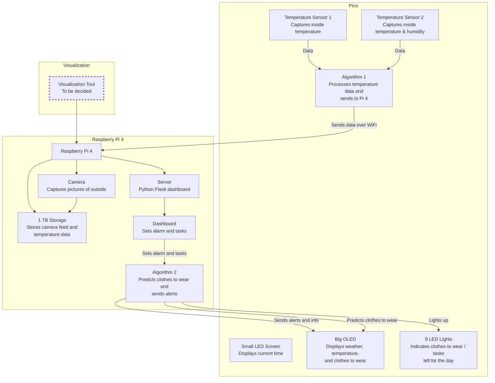

# SWEATER-IoT
**Smart Weather and Environmental Alarm for Temperature and Outfit Recommendations (SWEATER)**

## Project Overview
SWEATER-IoT is designed to provide smart recommendations for daily outfits based on current weather conditions and indoor temperatures. The system also functions as an alarm clock, displaying the current time, weather, and outfit suggestions, and allows users to set alarms and tasks via a Python Flask dashboard.

## System Architecture

## Components

### Pico
- Display exact things here
### Raspberry Pi 4
- Display exact things here
  
### Visualization
- **Tool**: To be decided

## Installation and Setup
Some step by step process

## Usage

something here

## License

This project is licensed under the MIT License. See the [LICENSE](LICENSE) file for details.

